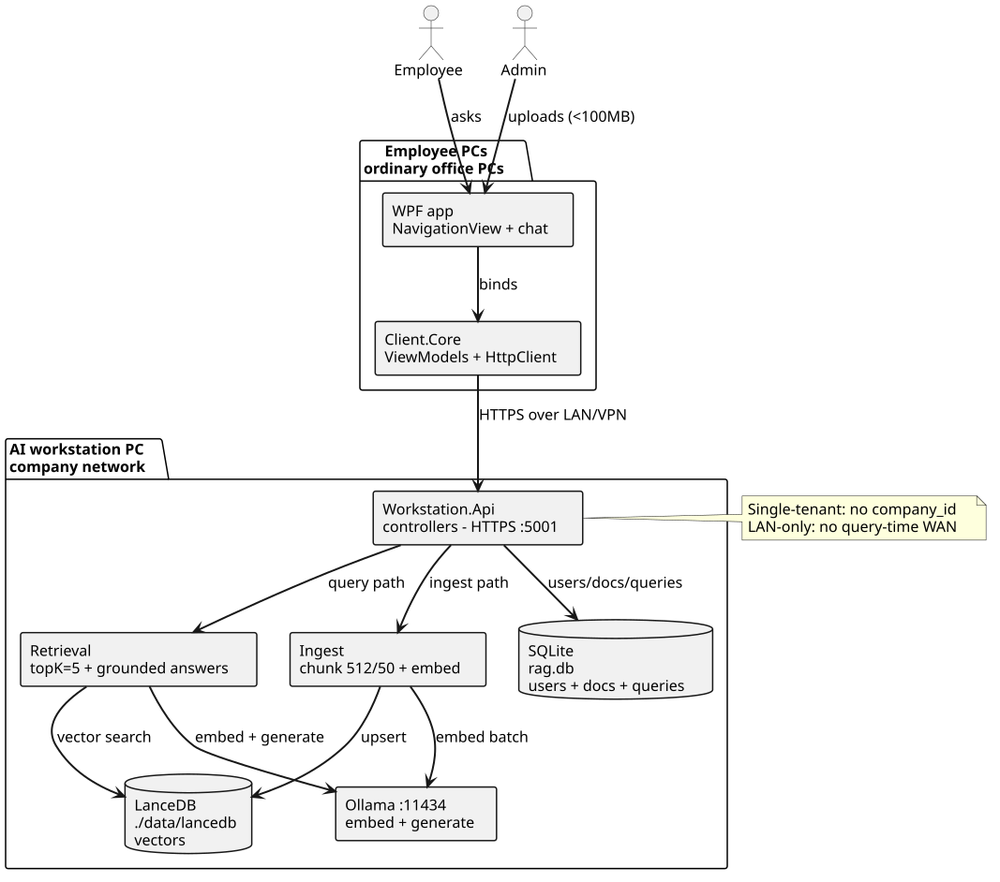
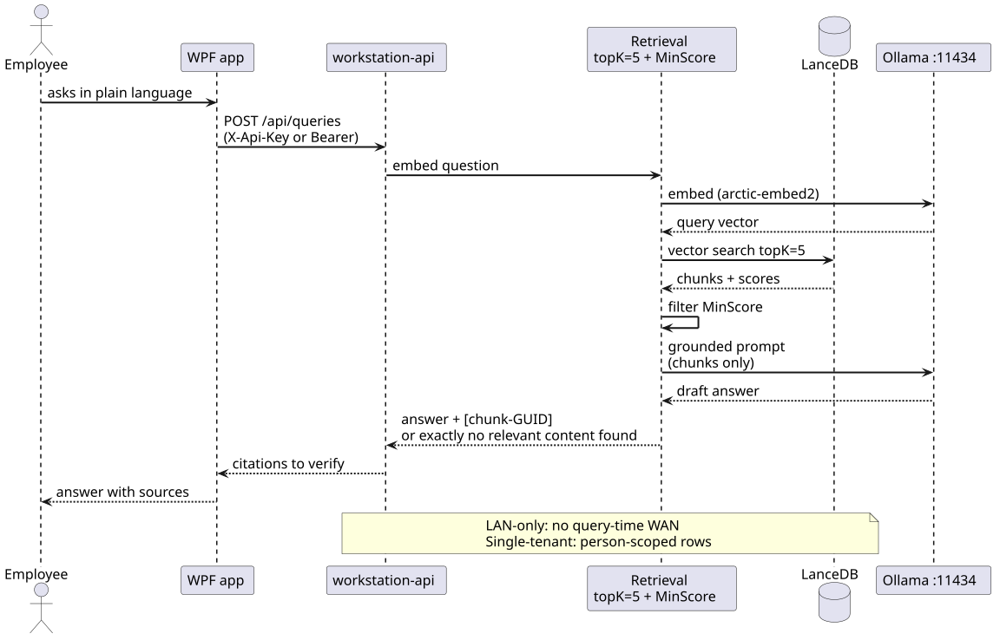
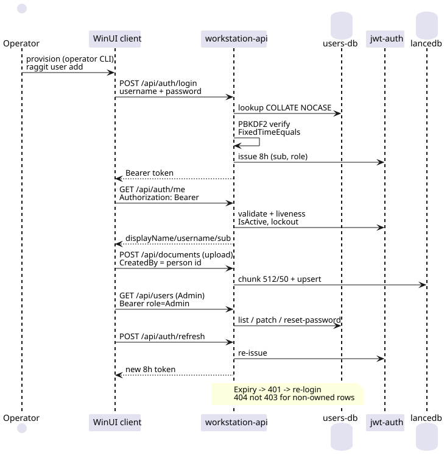

# RAGGit

A private, on-premises retrieval-augmented generation (RAG) system: it turns a
company's documents into a searchable library people can ask questions of in
plain language — every answer shows the passages it came from.

Everything runs on hardware you control. Documents never leave your network,
and answers are grounded in cited passages instead of being guessed.

## Features

- **Private by design** — runs fully on-premises; no cloud, no query-time internet.
- **Single-tenant** — one installation serves one company; no cross-company sharing.
- **Grounded answers** — every answer cites its source chunks, or returns
  exactly "no relevant content found" instead of hallucinating.
- **Per-user access** — admins manage documents and accounts; employees search
  and ask, and only ever see what they are allowed to see.

## How it works

An **AI workstation** — a capable machine on your network running
[Ollama](https://ollama.com) — stores documents, builds the vector index, and
answers queries. **Ordinary Windows PCs** run the desktop client, which talks
to the workstation over the LAN or VPN.


*System topology: the WPF desktop client talks to one workstation over the
LAN/VPN; documents, accounts, and answers stay on that machine.*


*What happens on a query: the workstation retrieves the relevant passages and
answers with named sources — or says nothing relevant exists instead of
guessing.*


*How people get in: an operator creates accounts, staff sign in for 8-hour
sessions, admins manage access.*

## Running it (developers)

Requirements: **.NET 10** (pinned by `global.json`) and
[Ollama](https://ollama.com) for the AI part.

```powershell
git clone https://github.com/daskas-welt/raggit.git
cd raggit
dotnet build RAGGit.sln -c Release -p:Platform=x64
ollama pull snowflake-arctic-embed2
ollama pull qwen2.5:3b
dotnet run --project src/RAGGit.Workstation.Api --urls https://localhost:5001
```

The API listens on `https://localhost:5001` by default. Building the full
solution needs Windows (it includes the WPF client); without the client, build
the server filter instead: `dotnet build RAGGit.Server.slnf -c Release`.

Create a login with the operator CLI. Run it from the API project, since the
database path is relative to the working directory:

```powershell
cd src/RAGGit.Workstation.Api
dotnet run -- user add --username me --display-name "Me" --role Admin --password "Passw0rd!"
```

The desktop client (`src/RAGGit.Client.WPF`) needs both `Workstation:Url` and
`Workstation:ApiKey` in its `appsettings.json` before it will connect.

Run the tests with:

```powershell
dotnet test tests/unit/RAGGit.Tests.Unit.csproj -c Release
dotnet test tests/contract/RAGGit.Tests.Contract.csproj -c Release
dotnet test tests/integration/RAGGit.Tests.Integration.csproj -c Release
```

`RequiresOllama` tests are skipped automatically when Ollama is not running, so
the suite stays green offline.

## Installing the app (end users)

The desktop client is built and distributed **per deployment by each company's
IT** — there is no public binary download, because the app is only useful
against a running workstation (it needs that workstation's URL and API key to
connect).

IT publishes the client as a self-contained executable and gives employees a
link; employees double-click the file, sign in with the credentials IT created,
and the app updates itself. To build that executable:

```powershell
dotnet publish src/RAGGit.Client.WPF -c Release -p:Platform=x64 -o ./out/desktop
```

## Project structure

- `src/RAGGit.Workstation.Api` — the workstation web service
- `src/RAGGit.Client.WPF` — the Windows desktop client (WPF + WPF-UI)
- `src/RAGGit.Client.Core` — shared client logic (view models, API clients)
- `src/RAGGit.Core` — shared domain types
- `src/RAGGit.Ingest` — document ingestion and chunking
- `src/RAGGit.Retrieval` — vector search and grounded prompt assembly
- `tests/` — unit, contract, and integration tests
- `docs/` — PlantUML diagram sources and the rendered SVGs used above

## License

[MIT](LICENSE) © 2026 Andreas Daskalopoulos. AI models stay on customer-owned
workstations and are never redistributed by this project.
