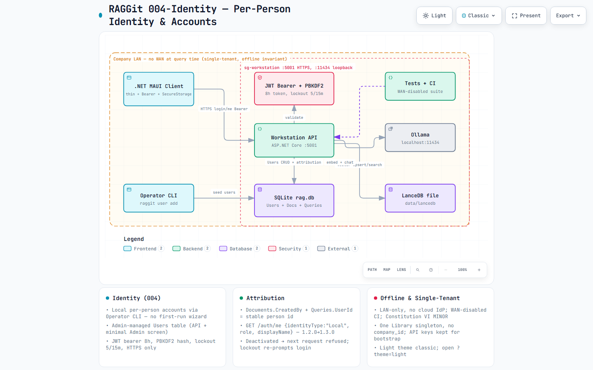
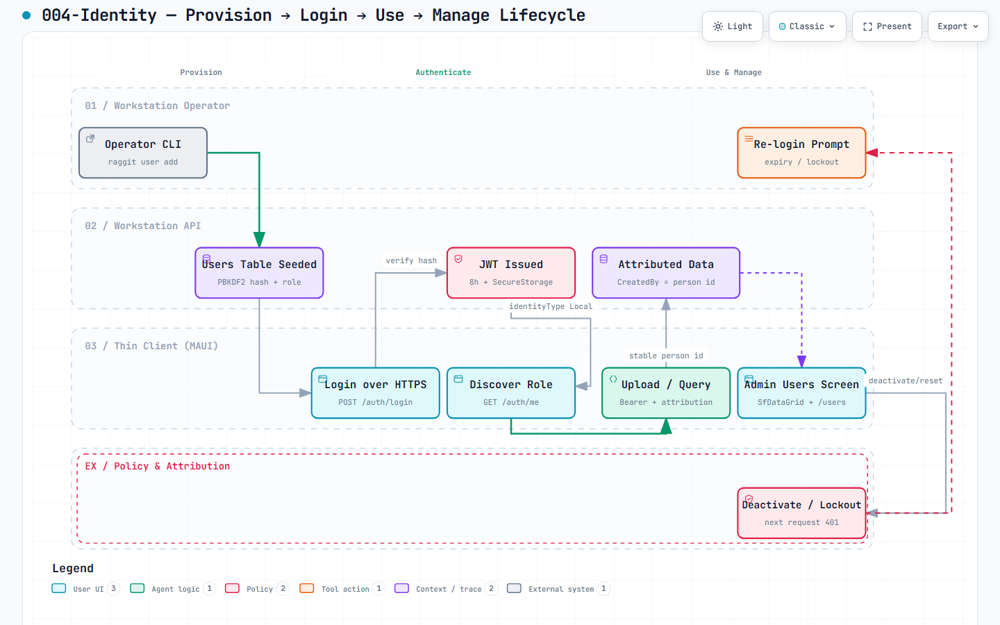
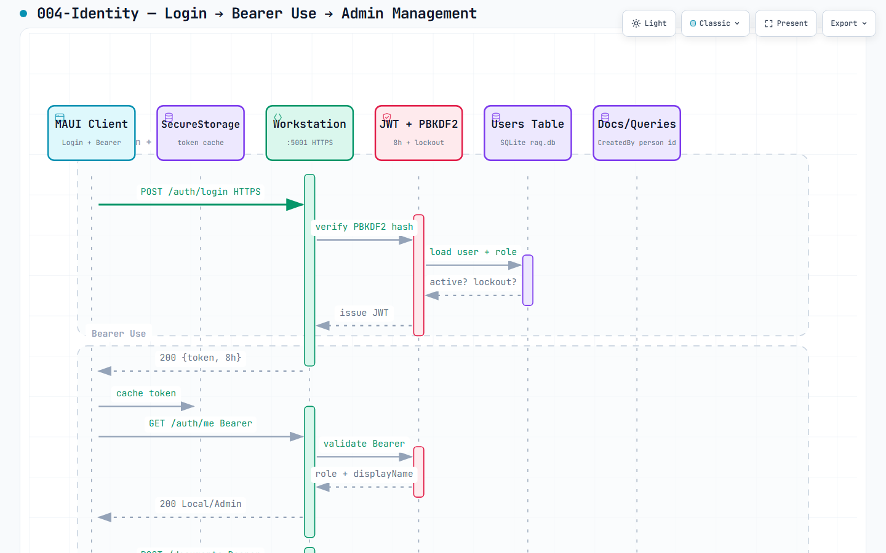
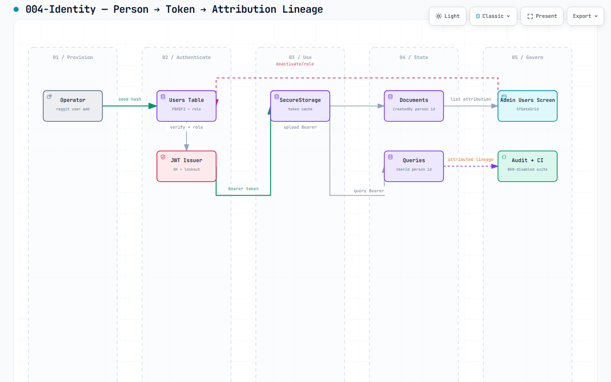

# RAGGit — Offline-Mode Single-Tenant RAG Library

> **Proprietary, on-prem, single-tenant RAG for companies.** An AI Workstation hosts the local vector store (`LanceDB` file) and local LLM (`Ollama`/`LLamaSharp`/`ONNX`) and serves a thin `.NET MAUI` client over LAN — no cloud egress at query time.

**Constitution**: `v1.1.0` ratified `2026-09-10` — `Single-Tenant On-Prem`, `Workstation-Owned AI`, `.NET Library-First & Client Reuse`, `Offline Invariant (NON-NEGOTIABLE)`, `Citation-Grounded RAG`, `Test-First`, `Simplicity & Proprietary` — see [`.specify/memory/constitution.md`](.specify/memory/constitution.md).

**Version**: `1.2.0` (API `contracts/api.yaml` MINOR — adds `xlsx` `application/vnd.openxmlformats-officedocument.spreadsheetml.sheet` + `413 100k cell cap` + `400 deep xlsx validation` per FR-001/005/006; `1.1.0` added `GET /api/auth/me` + `400 corrupted pdf`). `/health` reports `version:1.2.0`.

**Features**: `001-offline-mode` — [spec](./specs/001-offline-mode/spec.md) | `002-real-bringup` — [spec](./specs/002-real-bringup/spec.md) | [plan](./specs/002-real-bringup/plan.md) | [verification](./specs/002-real-bringup/verification.md) | `003-ingest-breadth` — [spec](./specs/003-ingest-breadth/spec.md) | [plan](./specs/003-ingest-breadth/plan.md) | [verification](./specs/003-ingest-breadth/verification.md) | `004-identity` — [spec](./specs/004-identity/spec.md) | [arch](./specs/004-identity/docs/architecture.html?theme=light) | [workflow](./specs/004-identity/docs/workflow.html?theme=light) | [sequence](./specs/004-identity/docs/sequence.html?theme=light) | [dataflow](./specs/004-identity/docs/dataflow.html?theme=light)

## Architecture

> Interactive diagrams — **click image for interactive HTML (`?theme=light`)**. GitHub blob view sanitizes HTML; use **raw.githack** to render, or download.

[](https://raw.githack.com/daskas-welt/raggit/main/docs/004-identity/architecture.html?theme=light)
*Architecture — showcase `216fad62` `c850aa23` `811kB` — Workstation API + JWT + Users + LanceDB + Ollama + MAUI + CLI — [interactive `?theme=light`](https://raw.githack.com/daskas-welt/raggit/main/specs/004-identity/docs/architecture.html?theme=light) · [spec source](specs/004-identity/docs/architecture.html?theme=light) · [docs mirror](docs/004-identity/architecture.html?theme=light)*

[](https://raw.githack.com/daskas-welt/raggit/main/docs/004-identity/workflow.html?theme=light)
*Workflow — `94965aa9` `1aca0cba` `811kB` — Provision → Login → Use → Manage — [interactive](https://raw.githack.com/daskas-welt/raggit/main/specs/004-identity/docs/workflow.html?theme=light)*

[](https://raw.githack.com/daskas-welt/raggit/main/docs/004-identity/sequence.html?theme=light)
*Sequence — `bfb222bc` `e5b3a0ec` `812kB` — Login → Bearer → Admin — [interactive](https://raw.githack.com/daskas-welt/raggit/main/specs/004-identity/docs/sequence.html?theme=light)*

[](https://raw.githack.com/daskas-welt/raggit/main/docs/004-identity/dataflow.html?theme=light)
*Dataflow — `0e58f73e` `45a85f70` `807kB` — Person → Token → Attribution lineage — [interactive](https://raw.githack.com/daskas-welt/raggit/main/specs/004-identity/docs/dataflow.html?theme=light)*

> Lifecycle is conditional for 004 and deferred (account states are linear; lifecycle diagram will be added if a retry/failure branch is introduced)
> Legacy showcase: **[docs/raggit.html?theme=light](docs/raggit.html?theme=light)** (`10d002…`) · [raw.githack](https://raw.githack.com/daskas-welt/raggit/main/docs/raggit.html?theme=light) · In-repo HTML at `specs/004-identity/docs/` (view → Raw → download)

```
Company LAN (no WAN at query time) — see architecture diagram above for interactive topology
AI Workstation (on-prem) ── LAN ── Employee Desktops (.NET MAUI thin clients)
├─ ASP.NET Core API (src/RAGGit.Workstation.Api) v1.3.0 (004 adds /auth/login + /users) ──┐
├─ LanceDB file data/lancedb (VectorDb:Path, VectorDb:VectorSize 384|768)                 │
├─ Ollama localhost:11434 (all-minilm 384 dev / nomic-embed-text 768 prod)                │
├─ SQLite rag.db — Users (PBKDF2, role, lockout 5/15m, 8h JWT, HTTPS) + Documents/Queries ──┘
MAUI Client: net8.0-windows10.0.19041.0 / net8.0-ios / net8.0-android + net8.0 CI fallback — SecureStorage token cache + Bearer handler + Admin UsersView (SfDataGrid) + LoginView
Operator CLI: raggit user add — OS trust anchor, no first-run wizard
API 004: POST /api/auth/login (HTTPS), GET /api/auth/me {identityType:"Local", role, displayName} (1.3.0), /api/users CRUD (Admin), 401/403/429, no partial index, offline invariant
Legacy Qdrant:Path warned if disagreeing with VectorDb:Path
```

**Dev on one machine**: workstation = `localhost:5001` + `localhost:11434`, desktop → `localhost:5001` (same machine, still LAN-only). See [Quickstart](#quickstart-single-machine-dev).

## Tech Stack

- **Language**: C# .NET 8 (`RAGGit.Core`/`Ingest`/`Retrieval`/`Workstation.Api`/`Client.Maui`)
- **Vector**: `LanceDB` .NET SDK embedded `connect(VectorDb:Path)` (file, no server; `VectorDb:VectorSize` 384|768 validated at startup, dimension guard fails fast with `delete data/lancedb` recovery). Legacy `Qdrant:Path` deprecated — startup Warning if disagreeing.
- **AI**: `OllamaSharp` (`POST /api/embed` + `/api/chat` + `TimeoutMs 5000` offline fail-fast → 503 `model unavailable offline`) or `LLamaSharp` GGUF + `ONNX Runtime` (`bge-micro-v2` + `Phi-3-mini`) behind non-default `Ingest:Embedder` flag (FR-005)
- **Client**: `.NET MAUI` `net8.0-windows10.0.19041.0` / `net8.0-ios` / `net8.0-android` + `net8.0` fallback for CI (no workload). No hard-coded URLs/keys — `Workstation:Url` + `Workstation:ApiKey` via `appsettings.json` + `GET /api/auth/me` role gating.
- **Testing**: xUnit + FluentAssertions, WAN-disabled integration suite, opt-in real suite `dotnet test --filter RequiresOllama` (skips gracefully when `Ollama:Url` absent per SC-003), 50 Q/A eval harness, `measureIngestPerformance.ps1` SC-001 gate

## Project Structure

```
RAGGit.sln (v1.1.0)
├── src/
│   ├── RAGGit.Core/              # Models Document/Chunk/Query, abstractions IVectorStore/IEmbedder/ILlmClient
│   ├── RAGGit.Ingest/            # Chunker 512/50 → embed (Ollama) → LanceDB upsert (CorruptDocumentException → 400)
│   ├── RAGGit.Retrieval/         # embed query → LanceDB search topK=5 → prompt → local LLM (timeout → 503)
│   ├── RAGGit.Workstation.Api/   # ASP.NET Core: /api/documents, /api/query, /api/auth/me, /health (v1.1.0)
│   └── RAGGit.Client.Maui/       # .NET MAUI net8.0-windows10.0.19041.0 / ios / android + net8.0 fallback — role-gated UI
├── tests/
│   ├── unit/ | contract/ | integration/  # WAN-disabled offline suite + opt-in RequiresOllama + SC-001 perf gate + SC-005 corruption
│   ├── fixtures/                 # sample-50pages.pdf (50 pages, refund policy) + bad.pdf / bad.docx (FR-006)
├── specs/001-offline-mode/       # spec.md, plan.md, quickstart.md (synced to 1.1.0), contracts/api.yaml 1.1.0
├── specs/002-real-bringup/       # spec.md, plan.md, research.md, data-model.md, quickstart.md, verification.md, contracts/api.yaml
├── scripts/                      # validate-quickstart.ps1, measureIngestPerformance.ps1
├── data/                         # .gitignored: data/lancedb (VectorDb:Path), rag.db; legacy data/qdrant warned
└── models/                       # .gitignored: *.gguf, *.onnx
```

## Quickstart — Single-Machine Dev (v1.1.0)

No workstation needed. Everything runs on `localhost`.

### Prereqs

- .NET 8 SDK (`dotnet --version` ≥8.0), Git LFS for ONNX (optional)
- 16GB RAM recommended (8GB works with `all-minilm` + `phi-3-mini` 384d), 10GB disk

### 1. Build

```powershell
git clone https://github.com/daskas-welt/raggit.git; cd raggit
dotnet workload install maui   # one-time for MAUI TFMs (optional — net8.0 fallback builds without it)
dotnet build RAGGit.sln
dotnet csharpier check .   # formatted per a9c7cb4 (CI enforces)
```

### 2. AI Models (once, then WAN can be off)

```powershell
ollama serve
# Dev laptop baseline (RAM-friendly, 384d):
ollama pull all-minilm
ollama pull phi3:mini
# Prod workstation baseline (separate box, 768d):
# ollama pull nomic-embed-text
# ollama pull llama3.2:3b
```

`src/RAGGit.Workstation.Api/appsettings.json` (dev defaults — `VectorSize` must match `EmbedModel` per FR-001):
```json
{
  "VectorDb": { "Path": "./data/lancedb", "Provider": "LanceDB", "VectorSize": 384 },
  "Qdrant": { "Path": "./data/qdrant" },
  "Ollama": { "Url": "http://localhost:11434", "EmbedModel": "all-minilm", "ChatModel": "phi3:mini", "TimeoutMs": 5000 }
}
```
Prod block in `appsettings.Development.json` comments `nomic-embed-text`/`768`/`llama3.2:3b`. Legacy `Qdrant:Path` is deprecated — startup Warns if disagreeing with `VectorDb:Path`.
```powershell
dotnet user-secrets set "Api:AdminKey" "dev-admin-key" --project src/RAGGit.Workstation.Api
dotnet user-secrets set "Api:EmployeeKey" "dev-employee-key" --project src/RAGGit.Workstation.Api
```

### 3. Run (2 terminals)

```powershell
# Terminal A — workstation (your "AI workstation")
Remove-Item -Recurse -Force ./data/lancedb -ErrorAction SilentlyContinue  # fresh DB after dimension swap
dotnet run --project src/RAGGit.Workstation.Api --urls http://localhost:5001
# Swagger http://localhost:5001/swagger  Health http://localhost:5001/health → {vectorDb:ok, llm:ok, version:"1.1.0"}
# Auth: curl http://localhost:5001/api/auth/me -H "X-Api-Key: dev-admin-key" → {identityType:"ApiKey", role:"Admin"}

# Terminal B — MAUI client (Windows 11 desktop primary; iOS/Android TFMs buildable but not acceptance per Q1)
dotnet run --project src/RAGGit.Client.Maui -f net8.0-windows10.0.19041.0
# or fallback net8.0 (no workload, views excluded, logic testable):
dotnet run --project src/RAGGit.Client.Maui -f net8.0
```

Client reads `src/RAGGit.Client.Maui/appsettings.json` (`Workstation:Url`, `Workstation:ApiKey` > `Api:AdminKey`/`Api:EmployeeKey`) and discovers role via `GET /api/auth/me` at launch (FR-003/FR-004). No hard-coded URLs/keys per `ClientConfigTests`.

### 4. Verify Offline Invariant + Corruption Hardening

```powershell
curl -X POST http://localhost:5001/api/documents -H "X-Api-Key: dev-admin-key" -F "file=@sample.pdf"
curl http://localhost:5001/api/documents -H "X-Api-Key: dev-admin-key"  # → [{status:Ready}] <5 min SC-001
# Corrupted pdf (FR-006 SC-005):
curl -X POST http://localhost:5001/api/documents -H "X-Api-Key: dev-admin-key" -F "file=@bad.pdf"
# → 400 {error:"corrupted pdf"}  # no partial index; GET /api/documents does not list it
# Disable WiFi (keep localhost), then:
curl -X POST http://localhost:5001/api/query -H "X-Api-Key: dev-employee-key" -H "Content-Type: application/json" -d '{"query":"refund policy"}'
# → {answer, citations:[{documentId, chunkId, text}]} or no relevant content found
# With Ollama stopped → 503 {error:"model unavailable offline"} within TimeoutMs 5000, never hang (FR-007)
```

### 5. Tests

```powershell
dotnet test                    # fakes only, no Ollama — CI must stay green (SC-003)
dotnet test --filter "RequiresOllama"   # opt-in real loop (needs ollama serve + all-minilm/phi3:mini + fresh data/lancedb)
pwsh ./scripts/measureIngestPerformance.ps1  # SC-001 perf gate: 50-page PDF <300s (fake <4s)
./scripts/validate-quickstart.ps1       # build + unit + contract + integration
dotnet csharpier check .        # formatting gate (CI)
```

## Specs — 001-offline-mode / 002 / 003

- **US-1 P1**: Admin upload → index Ready <5min for 50 pages (001) + xlsx multi-sheet Ready <30s (003 SC-001)
- **US-2 P1**: Employee WAN-off query → cited answer <7s p95 or `no relevant content found` + xlsx hidden never returned (003 SC-002) + formula cached 42.50 (SC-003)
- **US-3 P2**: Admin delete purges vectors
- **US-4 P3**: Employee browse read-only (403 on write)
- **FR-010**: pdf/docx/xlsx/txt/md — xlsx added in 1.2.0 (003) with 100k cell cap, hidden sheets skipped, header-repeat, cached formulas (video/audio still out of scope)
- **FR-011**: 5k docs / ~1M chunks, 512/50, topK=5 (xlsx 100k cap is per-doc guard orthogonal to 100MB)

## Development Workflow

Constitution-driven SDD: `constitution` → `specify` → `clarify` → `plan` → `tasks` → `implement`. `tasks.md` has 43 tasks phased as `Setup (T001-T006) → Foundational (T007-T013 BLOCKS) → US-1 (T014-T021) → US-2 (T022-T029 MVP) → US-3/4 → Polish`.

```powershell
# In .specify scripts (PowerShell)
.specify/scripts/powershell/create-new-feature.ps1 -ShortName "offline-mode" "..."
.specify/scripts/powershell/setup-plan.ps1
.specify/scripts/powershell/setup-tasks.ps1
```

## License

Proprietary — all rights reserved. Models stay on customer-owned workstations, not redistributed.

---

**Next**: `dotnet new` scaffolding per `tasks.md T001` → implement `Foundational` → `US-1` MVP ingest half → `US-2` query half (closed-loop shippable).
