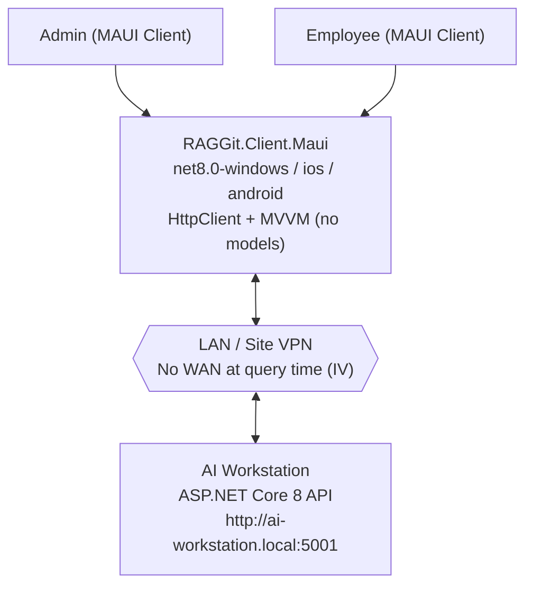
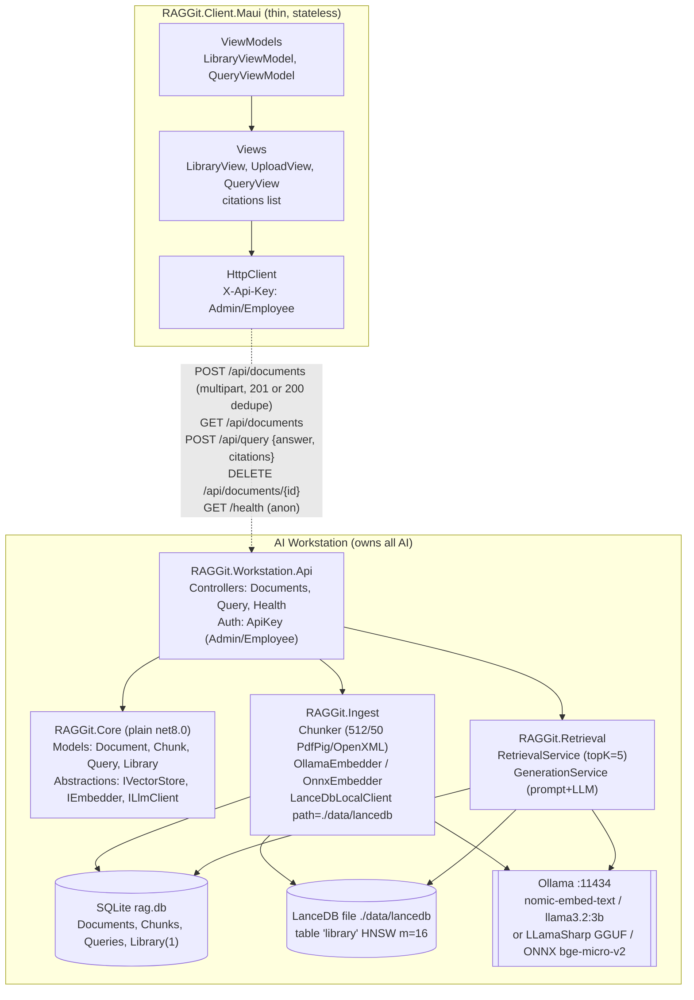
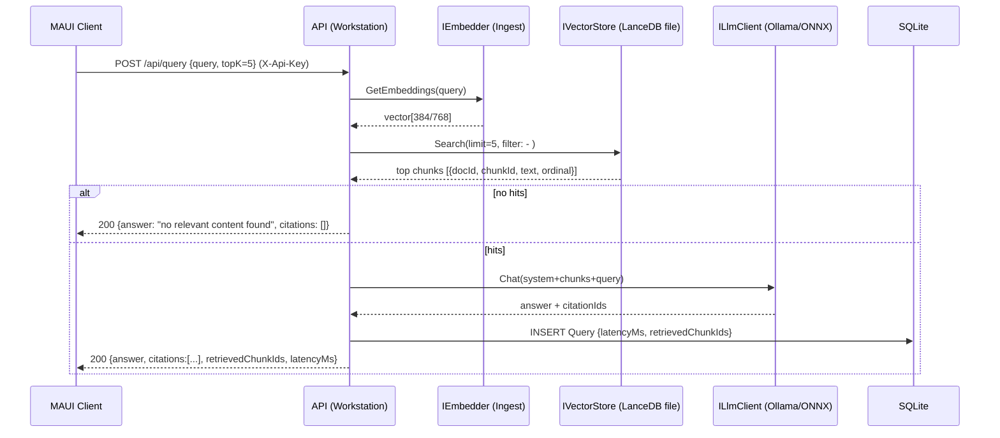
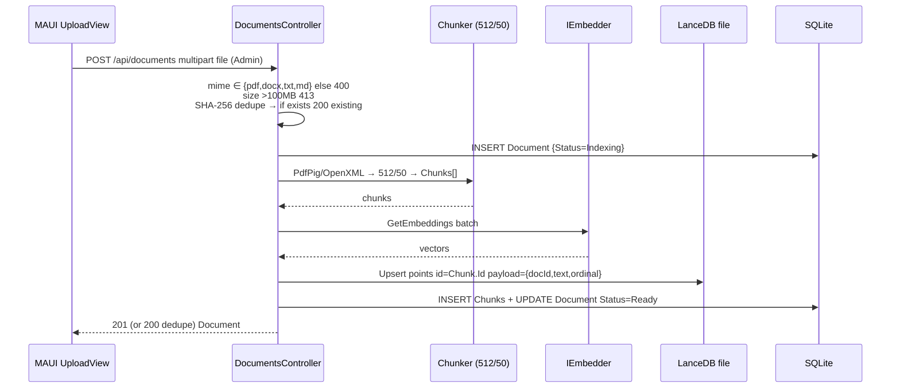

# RAGGit Architecture — 001-offline-mode (MAUI v1.1.0)

**Constitution:** `v1.1.0` • Single-tenant LAN-only • Workstation-Owned AI • MAUI Win11 + iOS/Android

## C4 Context (Single Deployment = 1 Company)



## Containers



## Query Sequence (WAN-OFF, LAN-only)



## Ingest Sequence (Admin Upload <100MB)



## Dependency Direction (Constitution II / III)

```
RAGGit.Client.Maui → RAGGit.Core (plain net8.0, no AI deps)
RAGGit.Workstation.Api → RAGGit.Core + RAGGit.Ingest + RAGGit.Retrieval
RAGGit.Ingest → RAGGit.Core (IVectorStore, IEmbedder)
RAGGit.Retrieval → RAGGit.Core (ILlmClient, IVectorStore via DI)
Core NEVER → Ingest/Retrieval
```

## Deployment (One-Tenant-Per-Workstation)

- Workstation: Win10+/Linux, 16GB+GPU, 10GB disk, `LanceDB path=./data/lancedb` + `rag.db` persisted, models pre-cached (no `ollama pull` at query)
- Client: MAUI `net8.0-windows10.0.19041.0` (MSIX signed) + `net8.0-android` (sideload) + `net8.0-ios` (Ad-Hoc/enterprise, Mac host) — all HttpClient-only over LAN/VPN
- Offline invariant: CI gate `T044` runs `QueryOfflineTests` WAN-disabled; `/health` anon

## File Map

`plan.md:60-70` • `spec.md:99-103` entities • `contracts/api.yaml:5` • `tasks.md:20-23` TFMs
